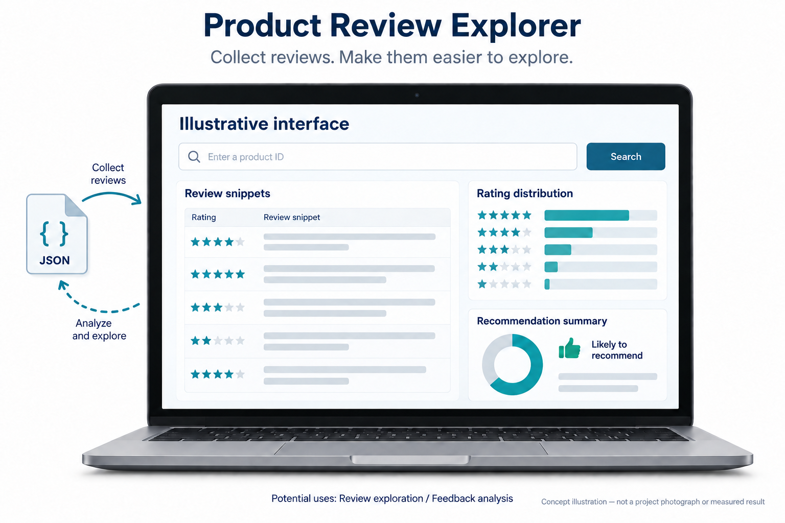
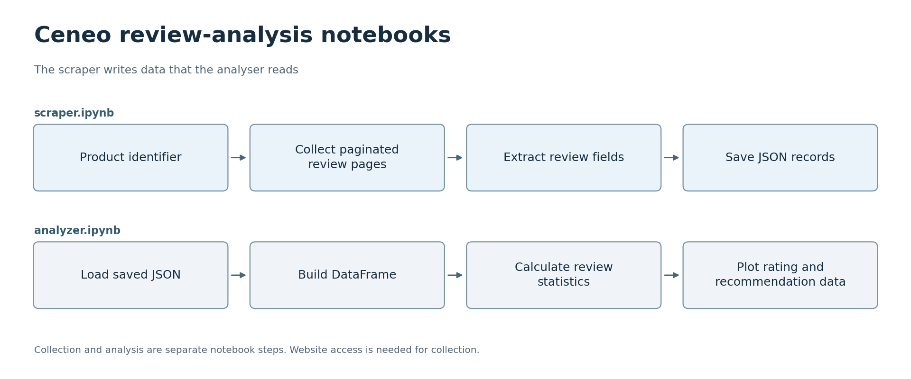

# 상품 리뷰 분석

[한국어](#korean) · [English](#english)

## 한국어

[코드 읽는 순서](#코드-따라-읽기)

이 노트북들은 상품 리뷰 수집과 분석을 분리합니다. [scraper.ipynb](scraper.ipynb)에는 수집 작업 흐름이, [analyzer.ipynb](analyzer.ipynb)에는 수집한 데이터를 처리하는 과정이 담겨 있습니다. 이들은 관련 [Flask 리뷰 애플리케이션](https://github.com/oldprize47-SH/Ceneo)과 연결되는 프로젝트입니다.

### 프로젝트 목표

수집한 상품 리뷰를 구조화된 레코드, 요약 통계, 읽기 쉬운 그래프로 바꿉니다.

AI 생성 개념도

### 활용할 수 있는 곳

이 작업 흐름은 리뷰 텍스트를 평점 및 추천 여부의 분포와 함께 읽으면서 수집된 상품 피드백을 살펴보는 데 도움이 될 수 있습니다. 구조화된 리뷰 레코드를 보관하면 모든 페이지를 다시 수집하지 않고도 분석을 반복할 수 있습니다. 요약을 읽을 때는 수집된 표본에 관한 결과이며 전체 고객을 대표하지 않는다는 점을 함께 참고하면 좋습니다. 수집 가능 여부는 원본 사이트와 허용된 접근 범위에 따라 달라집니다.

### 한눈에 보기

[SVG](docs/flowcharts/ceneo-notebooks.svg)

### 수집과 분석은 별도의 단계

수집 노트북은 상품 식별자를 받아 리뷰 페이지를 요청하고, 평점, 추천 여부, 본문, 장점, 단점 등의 필드를 추출합니다. 페이지 순서를 따라가며 리뷰를 수집하고, 구조화된 리뷰 레코드를 JSON으로 저장합니다. 선택자와 변환 함수는 원래 HTML과 분석에 사용하는 필드를 연결합니다.

분석 노트북은 저장된 레코드를 Pandas DataFrame으로 읽어 들입니다. 리뷰 수를 세고, 장점이나 단점이 포함된 리뷰가 각각 몇 개인지 확인하며, 평균 평점을 계산하고, 평점과 추천 여부의 분포를 그래프로 그립니다. 평점 그래프는 리뷰가 점수별로 어떻게 분포하는지 보여 주고, 추천 여부 그래프는 긍정·부정·응답 없음으로 구분합니다. 두 그래프는 수집된 리뷰를 이해하는 데 활용할 수 있습니다. 전체 고객을 대표하는 설문조사 결과는 아니라는 점을 함께 참고하면 좋습니다.

### 코드 따라 읽기

아래 순서는 파일의 역할과 연결을 이해하기 위한 안내입니다. 독립 과제나 보드별 프로그램은 한꺼번에 실행하지 않고 해당 항목의 실행 안내를 따릅니다.

| 순서 | 파일 | 역할과 다음 단계 |
|---|---|---|
| 1 | [scraper.ipynb](scraper.ipynb) | 상품 ID로 요청 주소를 만들고 리뷰를 파싱한 뒤 opinions/<상품 ID>.json에 저장합니다. |
| 2 | [analyzer.ipynb](analyzer.ipynb) | 같은 상품 ID의 JSON을 읽어 통계와 평점·추천 여부 그래프를 만듭니다. 두 노트북의 기본 상품 ID가 다르므로 맞춰야 합니다. |
| 3 | [requirements.txt](requirements.txt) | 실행 환경을 준비할 때 의존성을 확인합니다. 분석만 볼 때는 저장된 JSON이 있으면 수집 요청을 다시 할 필요가 없습니다. |

### 시작하기

실행 전에 내용을 살펴보고 싶다면 GitHub에서 `analyzer.ipynb`를 열어 JSON을 불러오는 부분부터 요약 통계와 그래프까지 따라가면 됩니다. 그런 다음 `scraper.ipynb`를 읽어 각 입력 필드가 어디에서 오는지 확인하면 됩니다. 이 순서는 데이터 처리에 관한 문제와 웹사이트에서 데이터를 추출하는 문제를 구분하는 데 도움이 됩니다.

로컬 사본을 실행하려면 Jupyter와 호환되는 환경을 사용하고, [requirements.txt](requirements.txt)를 확인한 뒤, 노트북의 상품 ID와 데이터 경로가 서로 맞는지 점검하면 됩니다. 분석을 실행할 때는 노트북과 호환되는 저장된 데이터셋이 필요합니다. 수집 노트북은 네트워크 요청을 보내며 사이트의 현재 구조에 의존합니다. 오프라인 테스트용 고정 자료가 아닙니다.

이 작업은 Sangheon Park의 2024년 교환학생 수업 과제에서 비롯되었습니다. 아카이브에서는 원래의 학습 맥락을 살펴볼 수 있습니다. 다만 제공된 모든 셀의 개인별 저작 여부나 운영 환경 배포 여부까지 확인할 수 있는 기록은 아닙니다.

저장된 노트북은 GitHub에서 읽을 수 있습니다. 두 노트북 모두 2026년 9월 28일 노트북 JSON 검사를 통과했지만, 셀은 다시 실행하지 않았습니다. 웹사이트, 원격 서비스, 원래 Python 환경의 변화가 실행에 영향을 줄 수 있습니다. 당시의 의존성 목록은 [requirements.txt](requirements.txt)에 있습니다.

기존 출력은 과거 수업 과제의 결과입니다. 이 사본을 위해 새로 리뷰를 수집하지 않았으며, 리뷰 텍스트의 권리는 원래 작성자에게 있습니다.

[원본 저장소](https://github.com/sangheon47/CeneoScraperAI11). 원래 이력과 저작자 표기를 유지합니다.

---

## English

[Code walkthrough](#code-walkthrough)

**Product Review Analysis**

These notebooks separate product-review collection from analysis. [scraper.ipynb](scraper.ipynb) contains the collection workflow, and [analyzer.ipynb](analyzer.ipynb) processes the resulting data. You can also explore the related [Flask review application](https://github.com/oldprize47-SH/Ceneo).

### Project goal

Turn collected product reviews into structured records, summary statistics and readable plots.

AI-generated concept illustration

### Where it could be used

The workflow could help someone explore collected product feedback by reading review text alongside rating and recommendation distributions. Keeping structured review records also makes it possible to repeat an analysis without recollecting every page. When reading the summaries, keep in mind that they describe the collected sample and do not represent all customers. Collection depends on the source site and permitted access.

### At a glance

[SVG](docs/flowcharts/ceneo-notebooks.svg)

### Collection and analysis are separate steps

The collection notebook takes a product identifier, requests the review pages and extracts fields such as the score, recommendation, text, advantages and disadvantages. It follows pagination and saves structured review records as JSON. The selectors and conversion functions are the connection between the original HTML and the fields used by the analysis.

The analysis notebook reads the saved records into a Pandas DataFrame. It counts reviews, checks how many contain advantages or disadvantages, calculates the average rating and plots rating and recommendation distributions. The rating chart shows how reviews are spread across scores; the recommendation chart separates positive, negative and missing responses. Both charts help you understand the collected reviews. They do not represent a survey of all customers.

### Where to begin

To explore the work without running it, you can open `analyzer.ipynb` on GitHub and follow the path from JSON loading to summary statistics and plots. Then read `scraper.ipynb` to see where each input field comes from. This order helps separate a data-processing question from a website-extraction question.

To execute a local copy, use a Jupyter-compatible environment, inspect [requirements.txt](requirements.txt), and check that the notebook's product ID and data paths match your setup. Analysis requires a compatible saved dataset. The collection notebook makes network requests and depends on the site's current structure; it is not an offline test fixture.

This work comes from Sangheon Park's 2024 exchange-student coursework. The archive offers a view of the original learning context. Its records do not establish individual authorship of every supplied cell or confirm a production deployment.

The saved notebooks can be read on GitHub. Both passed notebook JSON checks on 28 September 2026, but their cells were not rerun. Changes to the website, remote services or the original Python environment may affect execution. The dependency snapshot is in [requirements.txt](requirements.txt).

Existing output is historical coursework. No new review collection was performed for this copy, and the review text remains the property of its original authors.

[Original repository](https://github.com/sangheon47/CeneoScraperAI11). Original history and attribution are retained.

### Code walkthrough

Use this order to understand each file and its connections. Independent exercises and board targets are not one executable; follow the relevant run instructions below.

| Step | File | Role and next step |
|---|---|---|
| 1 | [scraper.ipynb](scraper.ipynb) | Build the request from a product ID, parse reviews and save opinions/<product ID>.json. |
| 2 | [analyzer.ipynb](analyzer.ipynb) | Load JSON for the same product ID and produce summary/rating/recommendation plots. The two notebooks currently use different default IDs; align them first. |
| 3 | [requirements.txt](requirements.txt) | Check dependencies before execution; existing compatible JSON lets you analyse without another collection request. |
