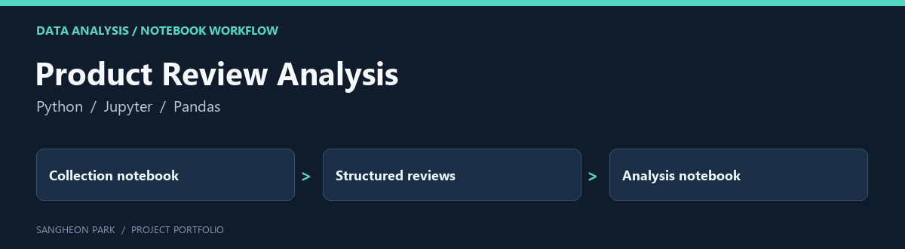

# Product Review Analysis

A companion notebook workflow separating product-review collection from analysis. It complements the Flask application without representing another independent deployed product.

[Portfolio home](https://github.com/oldprize47-SH) · [Original repository](https://github.com/sangheon47/CeneoScraperAI11)

## Contribution and context

This is a coursework archive. Product reviews and platform content retain their original ownership; notebook experiments are not a commercial data service.

## Code map

| Entry | Purpose |
|---|---|
| [scraper.ipynb](scraper.ipynb) | Historical collection workflow |
| [analyzer.ipynb](analyzer.ipynb) | Historical analysis workflow |
| [requirements.txt](requirements.txt) | Recorded notebook environment |

## Reading and verification

Read `scraper.ipynb` for the data flow, then `analyzer.ipynb` for analysis. Both
files passed version-4 notebook JSON checks on 2026-09-28; cells were not rerun.
Historical outputs may depend on changed page structure, remote services and an
old environment. No new network collection or independent benchmark was performed.

[Companion Flask application](https://github.com/oldprize47-SH/ceneo-review-webapp)

## Archive policy

The fork retains upstream history, source attributions and course material. The
portfolio documentation does not assign a new licence or claim sole authorship
of inherited code. Current checks are stated above; an untested component is not
presented as verified.
