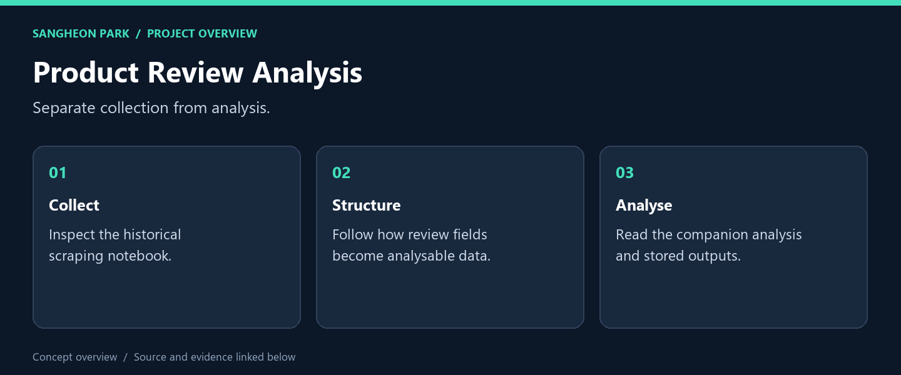
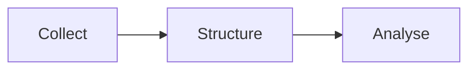

# Product Review Analysis

**A notebook workflow that separates data collection from analysis, complementing the Flask review application.**

[What I built](#what-i-built) · [My role](#my-role) · [Code and reproduction](#code-and-reproduction) · [Portfolio](https://github.com/oldprize47-SH)

## What I built

| Deliverable | What it does | Explore |
|---|---|---|
| **Collection notebook** | Trace data acquisition | [Source / result](scraper.ipynb) |
| **Analysis notebook** | Inspect processing and outputs | [Source / result](analyzer.ipynb) |
| **Environment record** | Historical dependencies | [Source / result](requirements.txt) |

### Result at a glance

Both notebooks passed JSON structure checks. Cells and external requests were not rerun.

## My role

This is a coursework archive. Product reviews and platform content retain their original ownership; notebook experiments are not a commercial data service.

## How it works

## Code and reproduction

## Reading and verification

Read `scraper.ipynb` for the data flow, then `analyzer.ipynb` for analysis. Both
files passed version-4 notebook JSON checks on 2026-09-28; cells were not rerun.
Historical outputs may depend on changed page structure, remote services and an
old environment. No new network collection or independent benchmark was performed.

[Companion Flask application](https://github.com/oldprize47-SH/ceneo-review-webapp)

## Source and credits

[Original repository](https://github.com/sangheon47/CeneoScraperAI11) · [Portfolio home](https://github.com/oldprize47-SH)

Course scaffolding, team contributions and third-party assets retain their original attribution. This documentation does not grant a new licence.
